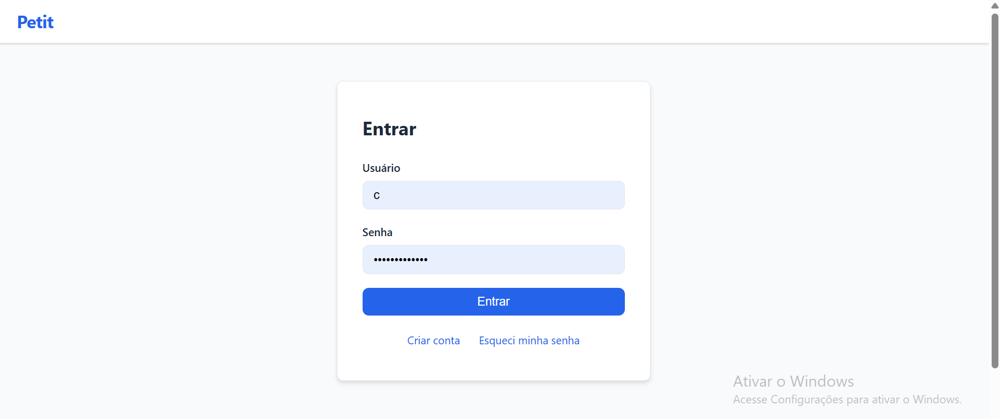
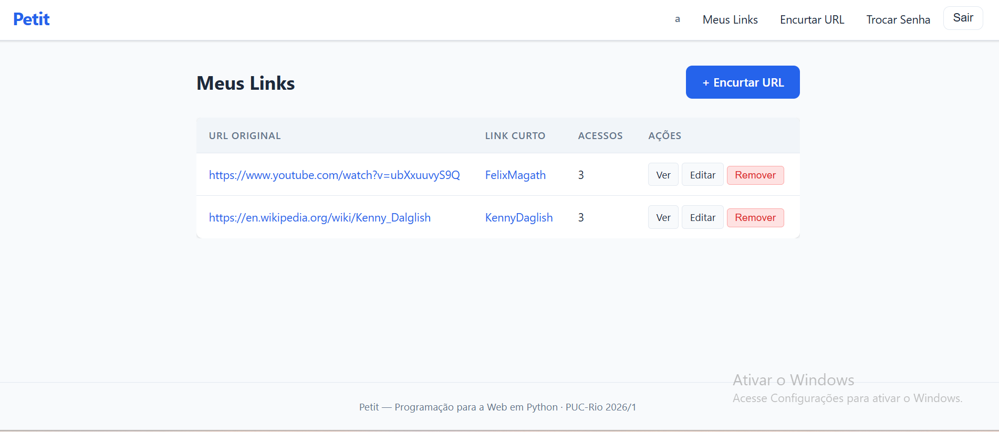
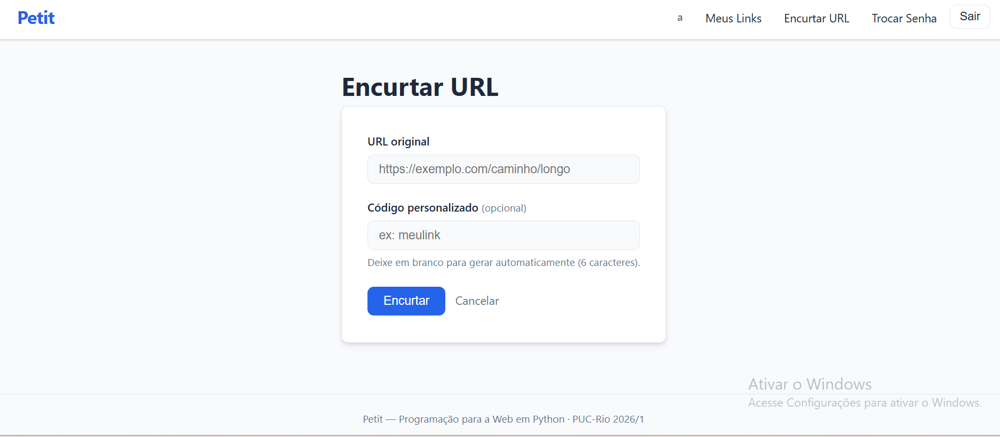

# Petit Web: Frontend do Encurtador de URLs

**Integrantes:** 
Fernando de Moraes Crescencio 2210834
Maria Alice Trinta Lima 2212994

---

## Descrição e escopo

**Petit Web** é o frontend do encurtador de URLs Petit. É um site estático composto por **HTML + CSS + TypeScript** (todo JavaScript é gerado pelo compilador `tsc`; nenhum JS é escrito manualmente). Ele consome a [API Petit](<!-- link do repositório A -->) via `fetch` com autenticação JWT.

### O que o frontend faz

- **Landing page** pública com apresentação do projeto e links de login/registro.
- **Registro e login** de usuários com armazenamento seguro do JWT no `localStorage`.
- **Dashboard** listando todos os links do usuário logado, com contagem de acessos.
- **Criação de link** com URL de destino e código personalizado opcional.
- **Edição** da URL de destino de um link existente.
- **Detalhe/estatísticas** de cada link (código, URL, total de acessos, datas).
- **Remoção** de links com confirmação.
- **Cabeçalho dinâmico** que alterna entre menu de visitante e menu logado (com username e link para "Admin Panel" se `is_staff`).
- **Troca de senha** autenticada.
- **Recuperação de senha** em duas etapas (solicitar código, confirmar nova senha).
- **Logout** client-side (remove tokens do `localStorage`).
- Renovação automática do `access_token` expirado usando o `refresh_token` (função `authFetch`).
- **Admin Panel** (`/adminPanel.html`) exclusivo para `is_staff`: lista todos os links de todos os usuários e permite remover qualquer um.

### Visões por usuário

Cada usuário vê **apenas os seus próprios links**. O backend filtra por `owner=request.user` e o frontend exibe exatamente o que a API retorna; duas contas diferentes nunca veem os dados uma da outra.

---

## Tecnologias

- HTML5 · CSS3 (variáveis, media queries, sem framework externo)
- TypeScript 6 (compilado para ES2019 via `tsc`)
- `fetch` API nativa para comunicação com o backend
- `localStorage` para armazenamento de tokens JWT
- Nginx (Docker) para servir os arquivos estáticos em produção

---

## Como instalar (local)

### Pré-requisitos

- Node.js 18+ (para o compilador TypeScript via `npm`)
- Python 3+ **ou** qualquer servidor HTTP estático (para servir `public/`)
- [Petit API](<!-- link do repositório A -->) rodando em `http://127.0.0.1:8000/`

### Passos

```bash
# 1. Clone o repositório
git clone <url-deste-repo>
cd petit-web

# 2. Instale o TypeScript
npm install

# 3. Compile os arquivos TypeScript para JavaScript
npm run build
# ou, para recompilar automaticamente ao salvar:
npm run watch

# 4. Sirva a pasta public/
python -m http.server 8080 --directory public
```

O site estará disponível em `http://localhost:8080/`.

> **Atenção:** o backend precisa estar rodando para o site funcionar. Veja o README do [petit-api](<!-- link -->).

### Rodar com Docker

O Dockerfile compila o TypeScript automaticamente durante o build.

```bash
docker build -t petit-web .
docker run -p 8080:80 petit-web
```

> Para apontar para um backend publicado, edite `typescript/constantes.ts` e troque `backendAddress` para a URL pública antes de buildar.

---

## Como usar (manual do usuário)

### Primeiro acesso

1. Abra `http://localhost:8080/`; você verá a landing page do Petit.
2. Clique em **Criar conta** e preencha usuário, e-mail e senha (mín. 8 caracteres).
3. Após o cadastro, você é redirecionado para o **Login**.
4. Faça login com usuário e senha; você vai para o **Dashboard**.

### Gerenciar links

| Ação | Como fazer |
|------|-----------|
| **Criar link** | Clique em *+ Encurtar URL*, cole a URL longa e (opcionalmente) defina um código personalizado. |
| **Copiar link curto** | No dashboard, clique no código curto; ele abre em nova aba. |
| **Ver estatísticas** | Clique em *Ver* na linha do link desejado. |
| **Editar URL de destino** | Clique em *Editar*, altere a URL e salve. O código curto não muda. |
| **Remover link** | Clique em *Remover* e confirme a remoção. |

### Gerenciar conta

| Ação | Onde |
|------|------|
| **Trocar senha** | Menu → *Trocar Senha* |
| **Esqueci minha senha** | Tela de login → *Esqueci minha senha* → informe o e-mail cadastrado → o código aparece nos logs do servidor (ver nota abaixo) → insira o código + nova senha |
| **Sair** | Menu → *Sair* (remove os tokens do navegador) |

---

## Capturas de tela


*Tela de login — autenticação com usuário e senha via JWT*


*Dashboard mostrando os links do usuário logado com contadores de acesso*


*Criação de link curto com código personalizado opcional*

---

## Links

- **Docker Hub:** https://hub.docker.com/repository/docker/fecrescencio/t02inf1407/general


---

## Estrutura do projeto

```
petit-web/
├── typescript/              ← código-fonte TypeScript
│   ├── constantes.ts        URL do backend + interfaces
│   ├── cabecalho.ts         navbar dinâmica + logout
│   ├── dashboard.ts         listagem de links (READ)
│   ├── urlCreate.ts         criação de link (CREATE)
│   ├── urlEdit.ts           edição de link (UPDATE)
│   ├── urlDetail.ts         detalhes e estatísticas
│   └── accounts/
│       ├── common.ts        authFetch, decodeJWT, helpers JWT
│       ├── login.ts
│       ├── register.ts
│       ├── passwordChange.ts
│       ├── passwordReset.ts
│       └── passwordResetDone.ts
└── public/                  ← servido ao navegador
    ├── index.html           landing page
    ├── dashboard.html
    ├── urlCreate.html
    ├── urlEdit.html
    ├── urlDetail.html
    ├── css/style.css        estilo próprio (variáveis CSS, responsivo)
    ├── javascript/          ← gerado pelo tsc (não versionar)
    └── accounts/            páginas de login, registro e senha
```

---

## Status (testado)

### Funciona

- Landing page pública
- Registro e login com JWT
- Renovação automática do access token via refresh (`authFetch`)
- Dashboard listando links do usuário logado
- Criação de link (com e sem código personalizado)
- Edição da URL de destino
- Remoção de link com confirmação
- Página de detalhes com estatísticas de acesso
- Cabeçalho dinâmico (visitante / logado / admin)
- Logout client-side
- Troca de senha autenticada
- Recuperação de senha por código (duas etapas; funciona, ver nota abaixo)
- Layout responsivo (mobile e desktop)
- Proteção XSS: todos os dados do servidor inseridos via `textContent`

### Limitações conhecidas

- **Recuperação de senha:** o código não é enviado por e-mail de verdade em desenvolvimento. Ele é impresso nos logs do servidor (`console.EmailBackend`). Para obtê-lo via Docker: `docker logs <id-do-container-backend>`. O campo e-mail deve ter sido preenchido no cadastro; se o usuário se registrou sem e-mail, o reset não funciona.
- Não há busca ou filtro de links no dashboard (lista completa sempre).
- O Admin Panel lista todos os links e permite remover qualquer um, mas não exibe estatísticas agregadas globais.
- O frontend foi testado nos navegadores Chrome e Edge; pode haver variações em navegadores mais antigos (IE não suportado).
